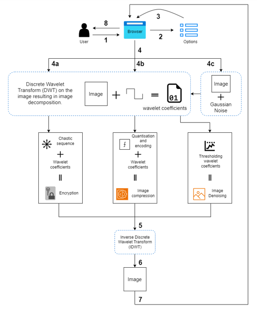

# 🌊 Wavelet Application (Detailed Report.md file)

A Django web application that demonstrates **image encryption, compression, and denoising** using **Wavelet transforms**.  
This project combines **signal/image processing** with a **web interface**, showing how wavelet-based methods can be applied in practice.

---

## 🔍 Overview
This project explores the use of the **Discrete Wavelet Transform (DWT)** in image processing.  
The system allows users to upload images, which are decomposed into wavelet coefficients and then processed for:  
- 🔐 **Encryption & Decryption**  
- 📦 **Compression**  
- 🎨 **Denoising**

The processed image is reconstructed using the **Inverse Discrete Wavelet Transform (IDWT)**.

---

## 🏗️ System Architecture

The diagram below shows the flow of the application:

 1. The user uploads the image to the web app via the browser with the option to perform the operation.
 2. The application records the option.
 3. The user can see the uploaded image and submit the image.
 4. According to the chosen option, the algorithm runs as:
   - (a) Encryption: The image is encrypted after performing wavelet decomposition on the images. The decomposed coefficients are arranged according to the chaotic sequence, and the image is encrypted.
   - (b) Compression: The algorithm performs quantisation and encoding to compress the image data.
   - (c) Denoising: Gaussian noise is added to the image before the decomposition, and then thresholding of the wavelet coefficients results in image denoising.
 5. Inverse Discrete Wavelet Transform (IDWT) of the coefficients is performed from the
 algorithms.
 6. Image restoration is done, which is the processed image.
 7. The processed image is displayed in the web app.
 8. The user can download the image.  

---

## ✨ Features
- Upload and process images via the browser.  
- Apply wavelet-based encryption, compression, or denoising.  
- Reconstruct images using inverse transforms.  
- Store uploaded and processed images in a database.  

---

## 🛠 Tech Stack
- **Backend:** Python, Django  
- **Image Processing:** PyWavelets, NumPy, OpenCV  
- **Frontend:** HTML, CSS, Django Templates  
