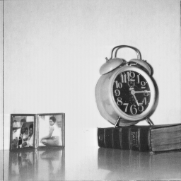
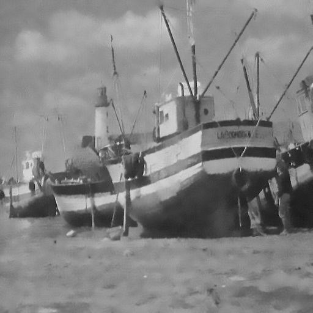
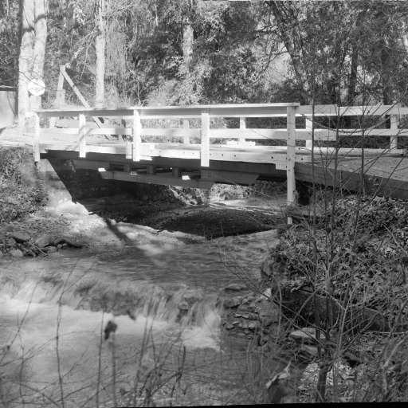
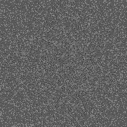

# 📊 Wavelet Application — Project Report

> A friendly, easy-to-follow explanation of what this project does, and the key results.
>
> Short version: upload an image → pick Compress / Denoise / Encrypt → see results and download.

---

## 📌 Quick summary
This is a web application (built with **Python / Django**) that applies **wavelet transforms** to images to:
- **Compress** images (make files smaller but keep them looking close to the original),  
- **Denoise** images (remove grain or unwanted noise), and  
- **Encrypt / Decrypt** images (scramble and restore images so they are private).

A one-sentence non-technical summary:
> The app helps you make pictures smaller, clearer, or private using smart maths (wavelets) — from a simple web page.

---

## ✅ Project goals
- Provide a user-friendly web interface so anyone can try wavelet-based image processing.  
- Demonstrate three tasks: **compression**, **denoising**, **encryption/decryption**.  
- Report performance using easy metrics so results can be compared.  

---

## 📁 Table of contents (what this report contains)
1. Overview (this section)  
2. How it works
3. Features (Compression / Denoising / Encryption) — simple explanations + metrics  
4. Results (visual and numeric) — example tables & graphs  
5. How it was built (short technical note)  
6. How to use the web app (user steps)  
7. Limitations & future work
8. Appendix: experiment tables, figures, code links, bibliography  

---

## 1. How it works
1. **Upload** an image from your computer.  
2. **Choose** one of three options: Compress, Denoise, or Encrypt.  
3. The server **processes** the image using wavelet math in the background.  
4. You **see** the result on the page, with simple numbers showing how well it did.  
5. You can **download** the processed image (or encrypted data file).  

---

## 2. The three features — explained simply

### A. Image Compression (make files smaller)
- What it does: removes small, unimportant details from the image so the file is much smaller but still looks similar.  
- Why it helps: saves storage and bandwidth (useful for backups, websites, or sending images).  
- Simple metric shown to users: **Compression Ratio (CR)** = Original size ÷ Compressed size.  
- Example (from experiments in this project):  
  - Original (Clock): 65,536 bytes → Compressed: 28,098 bytes → **Saved: 57.12%**.  

### B. Image Denoising (make pictures clearer)
- What it does: removes random grain or “noise” while keeping the picture’s details.  
- Why it helps: improves visual clarity and makes features easier to see.  
- Simple metrics:  
  - **PSNR (dB)**: higher = closer to original quality.  
  - **SSIM (0–1)**: closer to 1 = more similar.  
- Example: PSNR results for denoised images in the project lie in **~33–41 dB**, which indicates good quality. Example: **Airplane = 40.87 dB**.  

### C. Image Encryption / Decryption (keep images private)
- What it does: scrambles the image so it becomes unreadable; only someone with the right key (saved data) can restore it.  
- How it stores encryption: encrypted coefficients + indices are saved in a compressed NumPy file (a `.npz`).  
- Typical outcome: encrypted NumPy file can be *larger* than the original image (because it stores extra structural information). Example: **Clock 64 KB → Encrypted .npz 192 KB**.  
- Decryption quality: decrypted images match the original closely (high PSNR in experiments).  

---

## 3. Results — visual + numeric

### A. Visual evidence

1. **Original image (left)** — **Compressed (right)**  

  
  

2. **Noisy image (left)** — **Denoised (right)**  

  
  

3. **Original** — **Encrypted** — **Decrypted**  

  
  
  

    

---

### B. Key numeric tables

#### Table 1 — Encryption: original vs encrypted file sizes
| Image | Original size (KB) | Encrypted (.npz) size (KB) |
|---|---:|---:|
| Clock | 64 | 192 |
| Moon Surface | 64 | 309 |
| Fishing Boat | 256 | 1,299 |
| Airplane | 256 | 1,239 |
| Male | 1,048 | 5,300 |
*Source: experiment data.*  

#### Table 2 — Compression results
| Image | Original (bytes) | Compressed (bytes) | % Reduction |
|---|---:|---:|---:|
| Clock | 65,536 | 28,098 | 57.12% |
| Moon Surface | 65,536 | 59,430 | 9.31% |
| Fishing Boat | 262,144 | 181,222 | 30.86% |
| Airplane | 262,144 | 78,824 | 69.93% |
| Male | 1,048,576 | 764,966 | 27.04% |
*Source: experiment data.*  

#### Table 3 — Denoising: PSNR
| Image | PSNR (dB) |
|---|---:|
| Clock | 38.94 |
| Moon Surface | 37.03 |
| Fishing Boat | 36.29 |
| Stream & Bridge | 33.36 |
| Airplane | 40.87 |
| Male | 37.00 |
*Higher PSNR = closer to original; values ~30–40 dB = good quality.*  

---

## 4. Short technical note
- **Wavelets used:** Haar (simple and fast), Biorthogonal (bior4.4), Daubechies (db4), Symlet (sym4). Several are tested and compared.  
- **Encryption method:** Apply Discrete Wavelet Transform (DWT), flatten coefficients, permute using a chaotic map (logistic map), store indices and permuted coefficients in a `.npz` file. This is reversible with the saved indices/keys.  
- **Compression steps:** DWT → quantisation (divide coefficients by a factor) → thresholding (set very small values to zero using standard deviation) → Run Length Encoding (RLE) → save compressed representation.  
- **Denoising steps:** Add test Gaussian noise → decompose with several wavelets → threshold coefficients (soft/hard) → optionally apply non-local means → reconstruct and choose best PSNR result.  

---

## 5. How to use the web app
1. Open the homepage (run the Django server via `python manage.py runserver` for local use).  
2. Choose **Upload Image** and select your file.  
3. Select **Compress**, **Denoise**, or **Encrypt** from the options.  
4. Click **Submit** and wait for processing. Processing time depends on image size and server power.  
5. Preview the resulting image and see the metrics (CR, PSNR, SSIM).  
6. Click **Download** to save the processed image or the encrypted `.npz`.  
7. To decrypt, upload the `.npz` and click **Decrypt**.  

> Tip: For large images, consider resizing before upload to speed up processing.  

---

## 6. Limitations
- **Encrypted files can be larger** than originals because extra structural information is stored.  
- **Compression is lossy**: very aggressive compression reduces image quality (trade-off between size and visual fidelity).  
- **Web app CPU limits**: processing very large images can be slow on a small server—consider using a stronger machine or batch/queue processing for many images.  
- **Colour handling:** Some tests were done in grayscale; full RGB processing may increase file sizes and processing time.  

---

## 7. Future work
- Add user controls for **compression level** and **denoising strength**.  
- Add more wavelet families for comparison and automatic selection.  
- Provide **batch processing** and asynchronous tasks (e.g., using Celery) for large workloads.  
- Improve encryption storage so encrypted packages are smaller (study compact key storage).  
- Deploy to a public server for demonstration.  

---

## 8. Appendix (links and references)
- **Code / demo:** Link to this GitHub repository (add repo URL here).  
- **Key files to look at:** `manage.py`, `wavelet_webapp/` (Django app), `Screenshots/`, `media/images/`, and example `.npz` encrypted files.  
- **References & resources:**  
  - PyWavelets Documentation — https://pywavelets.readthedocs.io/  
  - OpenCV — https://opencv.org/  

---

*Prepared using data and experiment tables from the project documents and test runs.* 
